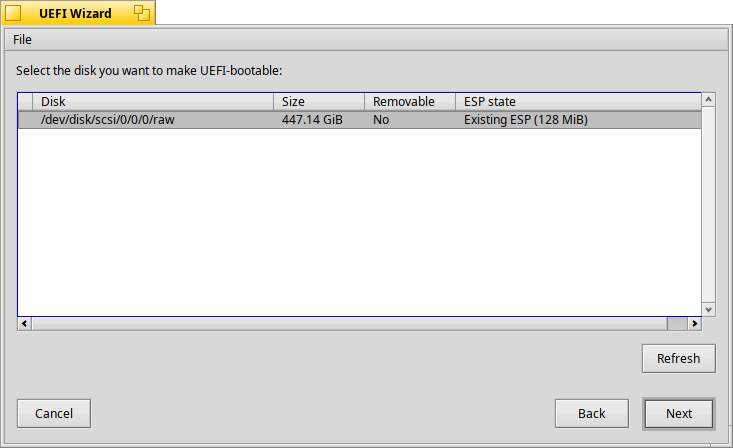
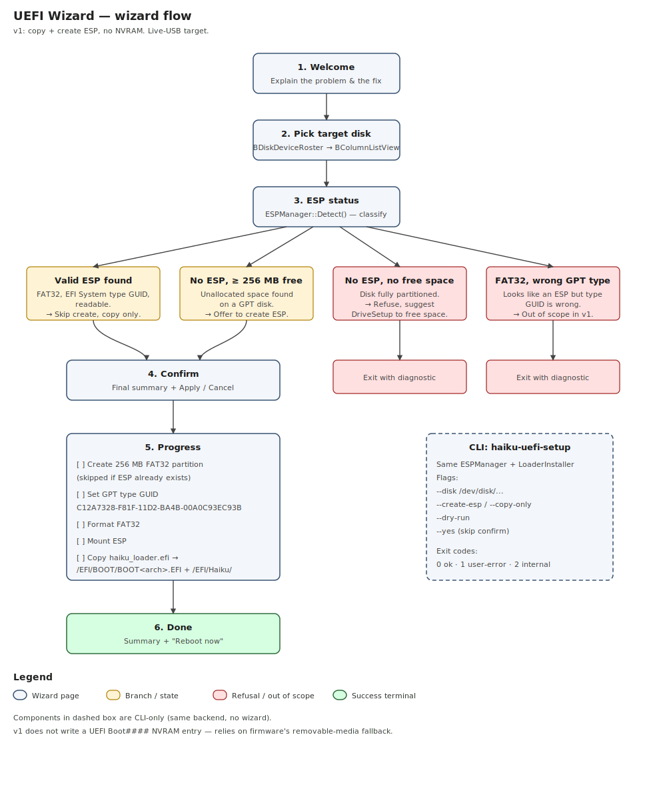
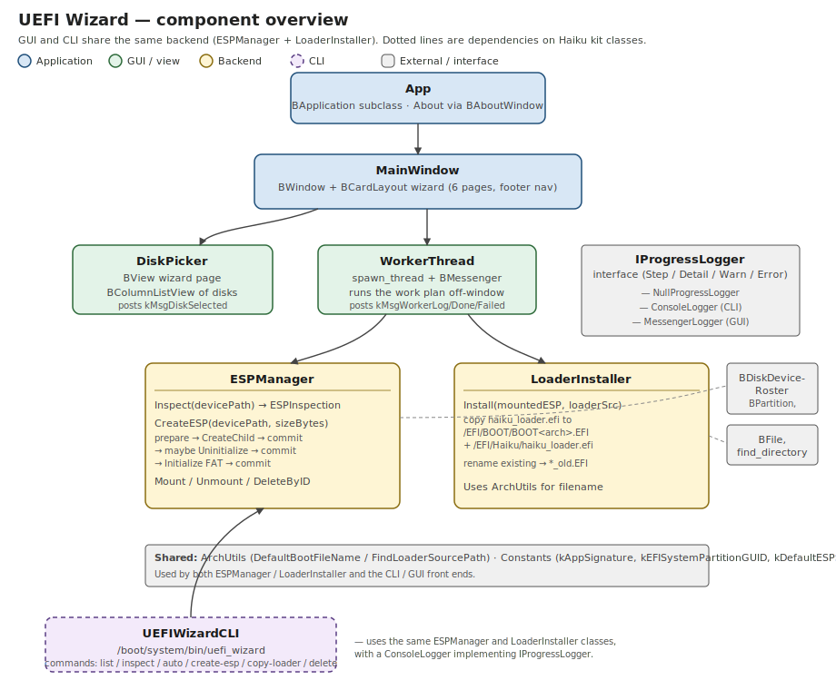

# UEFI Wizard

> [!WARNING]
> Partition and disk operations can be destructive! Please make sure important data is backed up, and pay close attention to drive selection.

> [!NOTE]
> An LLM was used to aid in development of this code.

A standalone tool for Haiku that finishes the EFI part of an installation
the built-in Installer leaves undone. On modern UEFI-only hardware,
Haiku's Installer writes a BIOS boot sector and nothing else — the EFI
System Partition (ESP) is never created and `haiku_loader.efi` is never
copied into place. The result is a successful "install" that won't boot.

This tool runs after Installer completes (typically still inside the
live USB session) and:

1. Detects the target disk and any existing ESP.
2. Creates a 256 MB FAT ESP with the correct GPT/MBR type identifier if
   none exists.
3. Copies `haiku_loader.efi` to `/EFI/BOOT/BOOT<arch>.EFI` and
   `/EFI/Haiku/haiku_loader.efi`.

A GUI wizard handles the common case; a `uefi_wizard` CLI does the
same work for headless or scripted recovery.



## Why this is needed

- The main install path (`WorkerThread::_PerformInstall`) shells out to
  `makebootable`, and the EFI build of `makebootable` is literally
  `int main() { return 0; }`.
- An `InstallEFILoader()` helper exists, but it only fires from
  `Tools > Install EFI loader` in the menu bar, and even then it
  requires the user to have hand-crafted a FAT32 partition tagged with
  the EFI System GPT GUID first.
- DriveSetup's "Change parameters → Partition type" path is broken
  ([#19194](https://dev.haiku-os.org/ticket/19194)), so the prerequisite
  hand-crafting often fails.
- There is no `efivars` kernel driver, so even a perfectly-placed loader
  can't be registered with firmware automatically.

The community workaround is "boot the live USB again and copy
`haiku_loader.efi` to `/EFI/BOOT/BOOTX64.EFI` by hand" — or use rEFInd.
This tool replaces the manual recipe with a guided GUI plus a scriptable
CLI.

## Wizard flow



Six pages:

1. **Welcome.** One-paragraph explanation of what's about to happen
   and why.
2. **Pick disk.** `BColumnListView` of disks with size, removability,
   and current ESP state visible at a glance.
3. **ESP status.** Result of `ESPManager::Inspect()` on the selected
   disk:
   - **Valid ESP found** — show its size. Action: copy loader.
   - **No ESP, ≥256 MB free** — offer to create one.
   - **No ESP, no free space** — refuse with guidance to use
     DriveSetup.
   - **Unsupported / no partitioning system** — refuse, suggest
     initializing the disk first.
4. **Confirm.** Final summary of the operation. The "Apply" button
   commits; "Cancel" still gets the user out without writes.
5. **Progress.** Per-step log streamed live from a worker thread:
   creating partition → clearing residual signature → formatting FAT →
   mounting → copying loader.
6. **Done.** Summary of what was written, with a quit button.

## Component overview



The CLI and GUI share the **`ESPManager`** and **`LoaderInstaller`**
classes directly; the only thing layered on top is the `MainWindow`
wizard plus a `WorkerThread` to keep long-running disk operations off
the window thread. Progress is reported through the
**`IProgressLogger`** interface, with three concrete implementations:
`NullProgressLogger` for silent paths, `ConsoleLogger` for the CLI, and
`MessengerLogger` for the GUI worker. Both surfaces stay in sync without
a translation layer.

## Scope

### In scope (v1)

| | |
| --- | --- |
| ESP detection | Walk `BDiskDeviceRoster`, classify partitions as `valid_ESP` / `none_but_free_space` / `none_no_free_space` / `unsupported_partitioning`. |
| ESP creation | Allocate a 256 MB FAT child partition with the EFI System type identifier (GPT GUID `C12A7328-F81F-11D2-BA4B-00A0C93EC93B` or MBR type byte `0xEF`). Requires unallocated space. |
| Loader install | Mount ESP, create `/EFI/BOOT/` and `/EFI/Haiku/`, copy `haiku_loader.efi` to `BOOT<arch>.EFI` and `haiku_loader.efi`. Rename pre-existing files to `*_old.EFI`. |
| Arch awareness | x86_64 → `BOOTX64.EFI`, x86 → `BOOTIA32.EFI`, arm64 → `BOOTAA64.EFI`, riscv64 → `BOOTRISCV64.EFI`. |
| GUI wizard | `BWindow` + `BCardLayout`, six pages, async worker for destructive ops. |
| CLI helper | `uefi_wizard` — same pipeline, scriptable. |

### Deliberately not in scope (v1)

- **Writing a UEFI `Boot####` NVRAM entry.** Needs a kernel `efivars`
  driver, which Haiku does not currently have. Once the loader is at
  `/EFI/BOOT/BOOT<arch>.EFI` the firmware picks it up as a
  removable-media fallback on virtually all hardware, which is enough
  to boot.
- **Shrinking an existing partition** to make room for the ESP. v1
  requires ≥256 MB of unallocated space on the target disk and refuses
  with a clear message otherwise.
- **Fixing the broken DriveSetup "Change parameters → Partition type"
  path.** That bug
  ([#19194](https://dev.haiku-os.org/ticket/19194)) needs an in-tree
  fix; this tool sidesteps it by setting the GPT type at *create* time,
  not modify time.
- **Loader-side robustness fixes.** Loader code is not shipped by this
  hpkg.

## Install (pre-built .hpkg)

Grab `uefi_wizard-<version>-x86_64.hpkg` from the releases page, drop
it in `~/config/packages/` (or double-click it for HaikuDepot), and
the app appears under Applications in the Deskbar. Run it from the
live USB session right after Installer finishes.

```sh
cp uefi_wizard-*.hpkg ~/config/packages/
```

To remove: delete the .hpkg from `~/config/packages/`.

## Build from source

Cross-built from a Linux host with a configured Haiku build tree
(cross-tools + a completed jam build):

```sh
bash package/build-hpkg.sh
```

Output: `build/uefi_wizard-<version>-x86_64.hpkg`. The script compiles
both the GUI (`UEFIWizard`) and CLI (`uefi_wizard`) binaries, compiles
the resources with `rc`, attaches them with `xres`, **and mirrors them
as file attributes with `resattr`** — the attribute step is required
for the app icon to appear (see `docs/STYLE_GUIDE.md` §22).

## Developer documentation

- [`docs/STYLE_GUIDE.md`](docs/STYLE_GUIDE.md) — project coding style
  (Haiku guidelines + project-specific rules).
- [`docs/icon-design.md`](docs/icon-design.md) — icon concept, palette,
  and the SVG → HVIF regeneration workflow.
- [`docs/phase2-findings.md`](docs/phase2-findings.md) — disk-device
  API gotchas surfaced during the API spike, with the validated call
  sequence.
- [`spike/`](spike/) — the historical Phase 2 verification CLI
  (predates the rename; kept as-is for archaeology).

## License

MIT — see [LICENSE](LICENSE).

## Author

Kevin Adams &lt;kevinadams05@gmail.com&gt;
